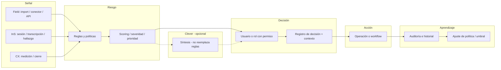

# Siete — Criterios de plataforma y contrato mínimo compartido (v1)

**Estado:** activo. **Ámbito:** producto, comercial, arquitectura. **Revisión:** al cambiar el modelo de hallazgos, permisos o ancla comercial.

## 1. Constitución (criterios de negocio)

1. **Una plataforma**, no productos sueltos: mejora continua y **reducción de riesgo operativo**. Hilo: **señal → riesgo → decisión → acción → aprendizaje**. La propuesta de valor global es **inteligencia aplicada** sobre investigación y experiencia, no “otro EMS ni otro builder”.

2. **Papeles por módulo**
   - **Field** — **PRE-FIELD:** diseño inteligente del estudio (brief, framework, journey, riesgos, QA consultivo, readiness). **FIELD:** control operativo, salud, hallazgos, scoring, ejecución real sobre datos de captura externa. FIELD **consume intención metodológica** creada en PRE-FIELD (continuidad operacional, no dos silos).
   - **InS (INS)** — voz, sesiones, hallazgos cualitativos; debe poder **alinearse** en el futuro a la misma memoria metodológica / señales que Field y CX cuando las APIs lo permitan.
   - **CX** — medición, cumplimiento, experiencia, cierre operativo; observa señales coherentes con **intención de estudio** donde exista vínculo de contexto.
   - **Clever** — aceleración (lectura, síntesis, soporte ejecutivo); **no** sustituye reglas ni gobernanza; **no** es el core; narra y resume con referencia a artefactos auditables.
   - **Perfil** — identidad y contexto del usuario o equipo dentro del ecosistema (capacidades, preferencias, continuidad entre productos); evolución técnica según roadmap; **no** sustituye tenant (`companies`) ni sub-tenant (`end_clients`).

3. **Ancla comercial hoy: Field** — primer mercado: investigación y campo; entrada por dolor: **pérdida por mala ejecución de campo**. Orden de expansión **no negociable por ahora:** Field abre → InS expande → CX madura relación → Clever eleva (sin ser requisito).

4. **Ecosistema real** = todos los módulos comparten el **contrato mínimo** (abajo). Sin eso, no es ecosistema: son productos separados.

5. **Cada módulo vendible solo** — sin “compra todo o no funciona”. Clever potencia, no requisito operativo.

6. **Field = capa de control**, no captura — no competir con SurveyToGo/Dooblo; integrar encima. Lo mismo: flexibilidad hacia **otros** líderes (Qualtrics, ODK, etc.) vía conectores y exportes.

---

## 2. Flujo de valor (referencia)

Una señal entra; se prioriza riesgo; alguien decide; se acciona; queda trazado y alimenta aprendizaje (política, umbrales).

---

## 3. Matriz de comprador (plantilla)

Completar con ICP real. Regla: comprador con **riesgo económico** o mandato claro.

| Módulo   | Comprador principal (budget) | Usuario principal | Gatekeeper  | Definición de éxito        |
|----------|--------------------------------|-------------------|------------|----------------------------|
| Field    |                                |                   |            |                            |
| InS      |                                |                   |            |                            |
| CX       |                                |                   |            |                            |
| Clever   | (add-on / sponsor)             |                   |            | Ahorro de tiempo, trazable |

---

## 4. Contrato mínimo compartido (técnico y semántico)

### 4.1 Identidad y acceso

- **Tenant:** `company_id` (o equivalente) en todo evento y artefacto persistido.
- **Usuario:** `user_id` del actor en acciones y auditoría.
- **Roles y permisos:** un modelo de acceso; los módulos **consumen** el mismo criterio (no duplicar reglas incompatibles).

### 4.2 Entidad unificada “hallazgo” (concepto mínimo)

Cada módulo puede tener tablas propias, pero el **significado** exportable / cruzable debe incluir al menos:

| Campo            | Notas |
|------------------|--------|
| `id`             | Único |
| `company_id`     | Tenant |
| `source_module`  | `field` \| `ins` \| `cx` (y futuros) |
| `source_ref`     | ID nativo en el módulo origen |
| `code`           | Código estable p. ej. `DOOBLO_QUOTA_UPSTREAM` |
| `severity`       | Mismo enum global: `info` \| `warn` \| `error` |
| `message`        | Texto operativo |
| `explanation`    | **Por qué** se disparó (regla, umbral, dato) — obligatorio para confianza enterprise |
| `evidence`       | JSON; sin PII innecesaria |
| `idempotency_key`| Recomendado para re-procesos |
| `created_at`     | Sí |
| Creador / sistema| Según política de auditoría |

**Clever:** no origina “hallazgo oficial” opaco; asiste con referencia a `source_ref` o borradores bajo entidad acotada.

### 4.3 Decisión e historial

- Entidad **decisión** (o `decision_log`): enlace a hallazgo(s), actor, instante, tipo (aceptar, mitigar, escalar, descartar con motivo), enlace a **acción** si aplica.
- **Field (implementación v1):** historial de cambios de gobernanza sobre un hallazgo en tabla `field_finding_decision_logs` (transición `approval_status`, nota opcional, actor, instante); API `GET …/decision-layer/findings/{id}/decision-log` y `PATCH …/approval` con cuerpo `{ status, note? }`.
- **Acción (evolutivo):** tarea, ticket, playbook — el modelo no debe bloquear la fase 2.

### 4.4 Auditoría (mínimo)

- `entity_type`, `entity_id`, `action`, `actor_id`, payload resumido o `before/after` donde aplique, `timestamp`, `company_id`.

### 4.5 API

- Cada request con contexto de tenant **validado en servidor**.
- Ningún hallazgo **sin** `company_id` y `source_module`.

### 4.6 Versionado

- `finding_schema_version` o migraciones explícitas al ampliar el contrato.

---

## 5. Relación con otros documentos

- Tenant, flags de producto y API transversal: [ECOSYSTEM_SIETE.md](ECOSYSTEM_SIETE.md)
- **Dirección de experiencia y continuidad PRE-FIELD ↔ FIELD ↔ ecosistema:** [7FIELD_PRODUCT_EXPERIENCE_DIRECTION_V1.md](7FIELD_PRODUCT_EXPERIENCE_DIRECTION_V1.md)
- Formato Field CSV: [FIELD_CSV_2026_1.md](FIELD_CSV_2026_1.md)
- **7Field — hallazgos (criticidad operativa, STOP/FIX_NOW/MONITOR), gobierno de reglas, Clever Executive Intelligence:** [7FIELD_FINDINGS_GOVERNANCE_AND_EXEC_INTEL_V1.md](7FIELD_FINDINGS_GOVERNANCE_AND_EXEC_INTEL_V1.md)
- **7Field — estrategia comercial (top 3 vendibles, narrativa inevitable, Clever, ancla Field):** [7FIELD_COMMERCIAL_STRATEGY_V1.md](7FIELD_COMMERCIAL_STRATEGY_V1.md)
- **7Field — plan de arquitectura, alcance por fases y tracción comercial (inicio de código):** [7FIELD_ARCHITECTURE_SCOPE_AND_TRACTION_V1.md](7FIELD_ARCHITECTURE_SCOPE_AND_TRACTION_V1.md)
- **7Field — decisiones estructurales cerradas (motor reglas, Study, Auto QA v1, Readiness, Clever enforcement):** [7FIELD_STRUCTURAL_DECISIONS_V1.md](7FIELD_STRUCTURAL_DECISIONS_V1.md)

## 6. Versionado de este documento

- **v1 (2026-04-24):** constitución, flujo Mermaid, matriz plantilla, contrato mínimo hallazgo/auditoría/decisión.
