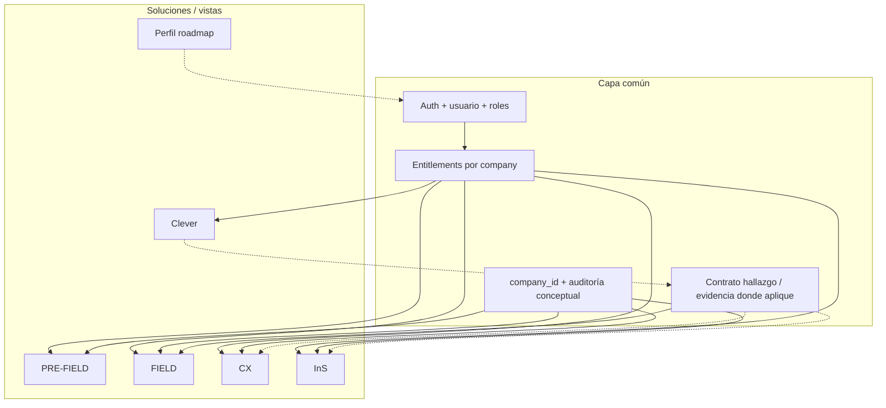

# Siete — Arquitectura de soluciones y capa común de acceso (v1)

**Estado:** activo · **tipo:** vista arquitectónica del ecosistema (no especificación de cada endpoint).

**Para qué sirve este doc:** describir **cómo se compone la plataforma**: qué tienen **en común** todas las soluciones (tenant, usuario, entitlement, auditoría conceptual) y en qué se **diferencian** **CX**, **InS**, **Clever**, **Field** (incl. **PRE-FIELD** y **FIELD**) y **Perfil** — qué problema resuelve cada una y qué límites tiene.

---

## Relación con otros documentos

- **Contrato de negocio y hallazgos mínimos:** [SIETE_PLATFORM_MINIMUM_CONTRACT_V1.md](SIETE_PLATFORM_MINIMUM_CONTRACT_V1.md)  
- **Flags, tenant, rutas base:** [ECOSYSTEM_SIETE.md](ECOSYSTEM_SIETE.md)  
- **Tesis experiencia + continuidad memoria:** [7FIELD_PRODUCT_EXPERIENCE_DIRECTION_V1.md](7FIELD_PRODUCT_EXPERIENCE_DIRECTION_V1.md)  
- **InS rutas MVP:** [SIETE_INS.md](SIETE_INS.md)  
- **CX / marco SERVQUAL:** [METHODOLOGY.md](METHODOLOGY.md)  
- **Field PRE-FIELD técnico profundo:** [7FIELD_PRE_FIELD_INTELLIGENCE_V1.md](7FIELD_PRE_FIELD_INTELLIGENCE_V1.md), modelo canónico y ADR en `docs/`.  
- **Clever ejecutivo:** [7FIELD_COMMERCIAL_STRATEGY_V1.md](7FIELD_COMMERCIAL_STRATEGY_V1.md) y [7FIELD_FINDINGS_GOVERNANCE_AND_EXEC_INTEL_V1.md](7FIELD_FINDINGS_GOVERNANCE_AND_EXEC_INTEL_V1.md).

---

## 1. Arquitectura común (todas las soluciones)

### 1.1 Identidad y multi-tenant

| Concepto | Significado |
|----------|-------------|
| **Tenant** | Empresa cliente de Siete: `companies` → `company_id` en payloads y rutas donde aplique. |
| **Usuario** | Actor humano (`user_id`): autenticación y roles compartidos por la API. El detalle RBAC por app evoluciona en código; el **principio** es un solo criterio de acceso interpretado por cada módulo ([SIETE_PLATFORM_MINIMUM_CONTRACT_V1.md](SIETE_PLATFORM_MINIMUM_CONTRACT_V1.md) §4.1). |
| **Sub-tenant Field** | **Cliente final del estudio** (`end_clients`): organiza proyectos Field y lineage comercial típico. Ver [ECOSYSTEM_SIETE.md](ECOSYSTEM_SIETE.md). |

### 1.2 Product entitlement (qué puede ver el usuario según empresa)

- **`GET /api/v1/entitlements/me?company_id=`** — devuelve qué **productos** están habilitados para el usuario actual en ese tenant (y **CX** como base implícita para tenant válido, según [ECOSYSTEM_SIETE.md](ECOSYSTEM_SIETE.md)).  
- **Activación manual (superadmin):** `PUT /api/v1/company/{id}` con `CompanyUpdate` — campos típicos `siete_field_enabled`, `siete_ins_enabled`, `siete_clever_enabled`.

El **frontend** debe **resolver menú / rutas** desde entitlements (`EntitlementsService` en Angular), no desde constantes cliente.

### 1.3 Contrato transversal sobre “inteligencia” y riesgo

- **Hallazgos** exportables siguen forma mínima común (**`source_module`**, severidad, explicación, evidencia…) — §4 del contrato de plataforma.  
- **Auditoría y decisiones** sobre artefactos críticos: mismo espíritu de trazabilidad (`actor`, instante, transición).  
- **Clever** y cualquier IA **consultiva** no sustituyen esa gobernanza: producen síntesis y priorización narrativa **ancladas** a objetos persistidos auditables ([7FIELD_COMMERCIAL_STRATEGY_V1.md](7FIELD_COMMERCIAL_STRATEGY_V1.md)).

### 1.4 Memoria metodológica viva (hilo vertebral)

Más allá del CRUD, el ecosistema busca que **decisiones, riesgos, journey y señales** sobrevivan al flujo que las generó y puedan consumirlas **otras vistas** cuando exista contrato de datos ([7FIELD_PRODUCT_EXPERIENCE_DIRECTION_V1.md](7FIELD_PRODUCT_EXPERIENCE_DIRECTION_V1.md) §0, §10). La **madurez técnica** es por módulos; el **criterio de PR** es no fragmentar esa memoria sin motivo documentado.

---

## 2. Tabla diferenciadora (resumen ejecutivo)

| Solución | Sirve para… | No es… | Habilitación / acceso típico |
|-----------|--------------|--------|------------------------------|
| **PRE-FIELD** (dentro de 7Field) | Preparar el **estudio** antes del levantamiento: brief, instrumento gobernado, QA, readiness, narrativa/journey esperada **persistidos**. | Un EMS/builder competitivo tipo Qualtrics; no la captura en sí. | `siete_field_enabled`; rutas bajo **`/api/v1/field/...`** (estudios, brief, revisiones, inteligencia de estudio). |
| **FIELD** (dentro de 7Field) | **Supervisar** ejecución: salud operativa, hallazgos, scoring, vista de proyecto con **contexto** heredado del diseño. | Reemplazo del software de campo; tabla cruda masiva como hero. | Igual PRE-FIELD; consume bundles de overview / hallazgos. |
| **CX** | **Medición y experiencia** de calidad según modelo híbrido (p. ej. SERVQUAL/RATER en [METHODOLOGY.md](METHODOLOGY.md)); evaluaciones y cierre operativo en producto CX. | Sustituto único del estudio cuantitativo Field ni del cualitativo InS; es otra cara de observación cuando el modelo de negocio lo usa. | Implícito en entitlements como producto base; rutas **`/api/v1/...`** del dominio CX (evaluaciones, etc.) según implementación vigente del repo. |
| **InS** | Investigación **cualitativa** guiada en plataforma: estudios (`ins_studies`), tubería hacia vídeo/audio → transcripción → análisis (roadmap articulado en [SIETE_INS.md](SIETE_INS.md)). | Reemplazo de Field ni EMS cuantitativo. | **`siete_ins_enabled`**; rutas **`/api/v1/ins/...`**; probe **`GET /ins/access`**. |
| **Clever** | **Executive Intelligence:** lectura ejecutiva priorizada sobre hallazgos, scoring y contexto autorizado ([7FIELD_COMMERCIAL_STRATEGY_V1.md](7FIELD_COMMERCIAL_STRATEGY_V1.md)). | Motor oficial de reglas ni origen único de “hallazgo cerrado”; no PowerPoint ornamental sin decisión. | **`siete_clever_enabled`**; consumo desde UI/servicios acoplados al contrato de hallazgos. |
| **Perfil** | Identidad/contexto **del usuario en el ecosistema** (preferencias, continuidad entre productos cuando exista modelo). | Sustituto del tenant **`companies`** ni de **`end_clients`**. | **Roadmap**: flag/tablas según formalice contrato futuro ([ECOSYSTEM_SIETE.md](ECOSYSTEM_SIETE.md)). |

---

## 3. Por solución — arquitectura de funcionamiento

### 3.1 7Field: PRE-FIELD vs FIELD (una solución productiva, dos momentos cognitivos)

Son **dos fases mentales del mismo ciclo operativo**, no dos productos ni dos licencias por separado en flags:

| Aspecto | **PRE-FIELD** | **FIELD** |
|---------|----------------|-----------|
| **Pregunta guía** | ¿Qué estamos diseñando y con qué riesgos **antes** de salir a campo? | ¿Cómo va la **ejecución** frente a lo que acordamos? |
| **Intervenciones típicas** | Brief persistido; instrumento/spec versionado; validación QA; readiness; **motor study intelligence** (journey, señales) como salida servidor. | Import/conectores/lecturas de datos de captura; overview; findings; dashboards de salud contextualizados por estudio. |
| **Persistencia clave** | Brief, revisiones, snapshots de inteligencia, gates — ver docs `7FIELD_*`. | Mismo estudio/proyecto; hallazgos, decision logs, vistas operativas. |
| **Límite explícito** | No ejecuta encuestas en terreno sobre el EMS. | No redefine metodología “de cero” sin pasar por diseño/readiness donde la política lo exija. |

**Campo técnico** unificado detrás del flag **`siete_field_enabled`**; la UI debe reflejar el **paso PRE → FIELD** como continuidad ([7FIELD_PRODUCT_EXPERIENCE_DIRECTION_V1.md](7FIELD_PRODUCT_EXPERIENCE_DIRECTION_V1.md) §3).

---

### 3.2 CX (Customer / Experience dentro de la plataforma)

- **Propósito:** operacionalizar mediciones de calidad/experiencia alineadas a marcos reconocibles (documento **[METHODOLOGY.md](METHODOLOGY.md)**).  
- **Acceso:** producto central del tenant válido desde entitlements; permisos finos por UX de evaluaciones y flujos existentes en `cx-backend` / `cx-frontend`.  
- **Diferenciación:** produce **evidencias y scores** propios del dominio CX; su convergencia con “intención de estudio” Field es **roadmap contractual** donde haya vínculos de contexto ([SIETE_PLATFORM_MINIMUM_CONTRACT_V1.md](SIETE_PLATFORM_MINIMUM_CONTRACT_V1.md)).

---

### 3.3 InS (investigación cualitativa)

- **Propósito:** gestionar estudios cualitativos y, en roadmap, pipelines de medio → texto → síntesis bajo empresa y políticas ([SIETE_INS.md](SIETE_INS.md)).  
- **Acceso:** **`siete_ins_enabled`**; roles 1–3 requieren flag; probe sin 403 antes de navegar UI.  
- **Diferenciación:** objeto central **estudio InS**, no proyecto Field; eventual alineación a memoria metodológica compartida vía enlaces futuros entre modelos.

---

### 3.4 Clever (Executive Intelligence — add-on)

- **Propósito:** compactar volumen operativo en **decisiones y narrativa ejecutiva**, referenciando hallazgos y artefactos gobernados.  
- **Acceso:** **`siete_clever_enabled`**.  
- **Diferenciación:** opcional para operar campo; aumenta velocidad cognitiva de dirección pero **no** reemplaza aprobaciones ni motor de criticidad oficial.

---

### 3.5 Perfil (roadmap explícito)

- **Propósito:** cómo cada persona o equipo experimenta **Siete** en el tiempo — preferencias, rol extendido y continuidad entre productos.  
- **Acceso:** aún sin flag único canonizado como InS/Clever; evolucionar según modelo de datos perfil/pertenencia cuando producto lo cierre ([ECOSYSTEM_SIETE.md](ECOSYSTEM_SIETE.md)).

---

## 4. Evolución y frontends

Las **implementaciones Angular** pueden refactorizarse; lo que debe mantener estable es esta **segmentación conceptual** más el **contrato** de datos y entitlement. Diseño UI evoluciona hacia patrones definidos en [7FIELD_ARCHITECTURE_SCOPE_AND_TRACTION_V1.md](7FIELD_ARCHITECTURE_SCOPE_AND_TRACTION_V1.md) sin congelar “pixel-perfect” legacy ([7FIELD_PRODUCT_EXPERIENCE_DIRECTION_V1.md](7FIELD_PRODUCT_EXPERIENCE_DIRECTION_V1.md) §Cursor vs producto).

---

## Versiónado

| Versión | Cambio |
|---------|--------|
| **v1 (2026-05-25)** | Primera vista unificada: capa común + PRE-FIELD/FIELD/CX/InS/Clever/Perfil + enlaces canónicos. |
